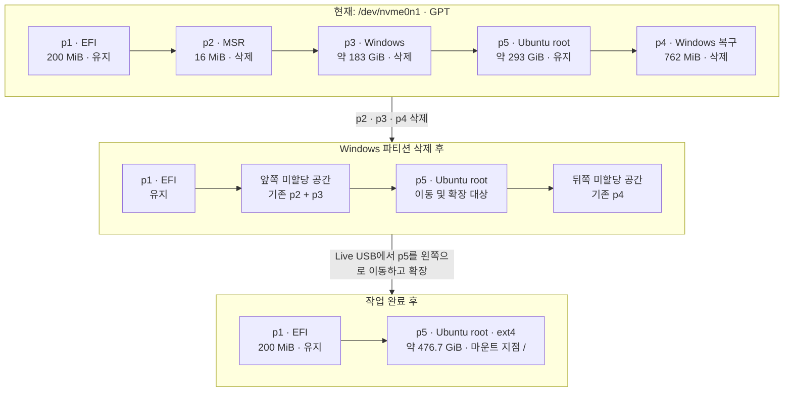
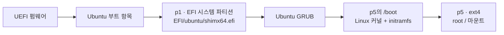
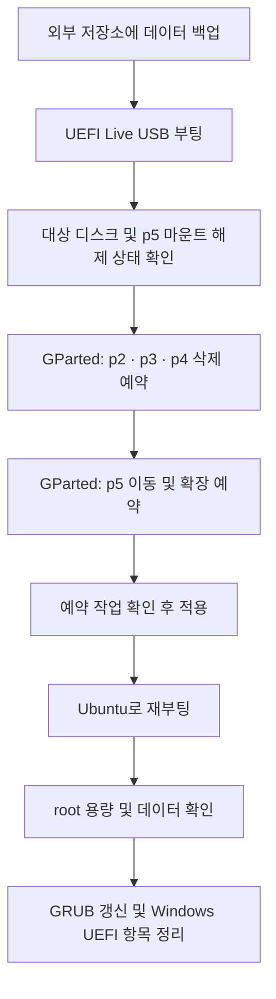

# Windows 제거 후 Ubuntu root 파티션 확장

## 문서 목적

- 대상 디스크: `/dev/nvme0n1`
- 목표
  - Windows OS 및 복구 파티션 제거
  - 확보한 공간을 Ubuntu root 파티션에 편입
- 작업 방식
  - Ubuntu 또는 GParted Live USB로 부팅
  - Windows 파티션 삭제
  - Ubuntu root 파티션 이동 및 확장

> [!CAUTION]
> 파티션 삭제 및 시작 위치 이동이 포함된 작업이다. 작업 전 [Ubuntu 백업 및 복원](ubuntu-backup-and-restore.md)에 따라 별도 물리 디스크에 데이터를 백업하고 검증한다. 작업 중에는 전원 공급을 중단하지 않는다.

## 현재 시스템 정보

| 구분 | 항목 | 정보 |
|---|---|---|
| 시스템 | OS | Ubuntu 26.04.1 LTS |
| 시스템 | 디스크 | `/dev/nvme0n1` — 약 476.9 GiB |
| 시스템 | 파티션 테이블 | GPT |
| 시스템 | 부팅 방식 | UEFI |
| root 파일시스템 | 장치 | `/dev/nvme0n1p5` |
| root 파일시스템 | 형식 | ext4 |
| root 파일시스템 | 마운트 지점 | `/` |
| root 파일시스템 | 전체 공간 | 약 288 GiB |
| root 파일시스템 | 사용 공간 | 약 255 GiB |
| root 파일시스템 | 여유 공간 | 약 19 GiB |
| root 파일시스템 | 사용률 | 94% |

## 현재 파티션 배치

| 파티션 | 크기 | 용도 | 작업 |
|---|---:|---|---|
| `/dev/nvme0n1p1` | 200 MiB | EFI 시스템 파티션 | 유지 |
| `/dev/nvme0n1p2` | 16 MiB | Microsoft Reserved 파티션 | 삭제 |
| `/dev/nvme0n1p3` | 약 183 GiB | Windows C: BitLocker 파티션 | 삭제 |
| `/dev/nvme0n1p5` | 약 293 GiB | Ubuntu root 파티션 | 유지 후 확장 |
| `/dev/nvme0n1p4` | 762 MiB | Windows 복구 파티션 | 삭제 |

```text
[p1 EFI][p2 MSR][p3 Windows][p5 Ubuntu /][p4 Windows Recovery]
```

- `/dev/nvme0n1p5`는 Windows가 아닌 현재 Ubuntu root 파티션
- `/dev/nvme0n1p5` 삭제 및 포맷 금지
- `/dev/nvme0n1p1`은 Ubuntu 부팅에도 사용되는 EFI 시스템 파티션
- `/dev/nvme0n1p1` 삭제 및 포맷 금지
- `p2`에서 ext4 서명이 감지되더라도 GPT 파티션 유형과 위치·크기상 Microsoft Reserved 파티션으로 판단
- Windows 공간이 root 파티션 앞쪽에 위치
  - 실행 중인 Ubuntu에서 단순 확장 불가
  - Live USB에서 root 파티션 시작점을 왼쪽으로 이동 필요

## 아키텍처

### 디스크 구조 변경

- 각 행은 디스크의 낮은 주소에서 높은 주소 순서
- 연결선은 파티션의 물리적 배치 순서 표시
- 도형 너비는 실제 용량 비율과 무관
- 최종 root 파티션 크기: 약 476.7 GiB 예상
- `df`에 표시되는 파일시스템 용량은 메타데이터 등으로 파티션 크기보다 작을 수 있음



### Ubuntu 부팅 구조

- UEFI의 Ubuntu 항목이 `p1`의 부트로더 실행
- Ubuntu 부트로더가 `p5`의 커널과 initramfs 로드
- 부팅 과정에서 `p5`의 ext4 파일시스템을 root(`/`)로 마운트
- Windows 제거 후에도 `p1`과 Ubuntu 부트 파일 유지 필요



### 작업 실행 흐름

- 설치된 Ubuntu root를 이동하는 작업은 Live USB에서 수행
- 완료 후 설치된 Ubuntu로 부팅하여 용량 및 부트 메뉴 검증



## 삭제 및 유지 대상

### 삭제 대상

- `/dev/nvme0n1p2`
  - Microsoft Reserved 파티션
  - 크기: 16 MiB
- `/dev/nvme0n1p3`
  - Windows C: 파티션
  - BitLocker 적용 상태
  - 크기: 약 183 GiB
- `/dev/nvme0n1p4`
  - Windows 복구 파티션
  - 크기: 762 MiB

### 유지 대상

- `/dev/nvme0n1p1`
  - EFI 시스템 파티션
  - Ubuntu 부트로더 포함
- `/dev/nvme0n1p5`
  - 현재 Ubuntu root 파티션
  - 삭제하지 않고 이동 및 확장

## 작업 전 준비

- 중요 데이터 백업
  - 현재 root 사용량 약 255 GiB 고려
  - 동일 NVMe 디스크가 아닌 외장 디스크 또는 별도 저장소 사용
  - [Ubuntu 백업 및 복원](ubuntu-backup-and-restore.md)을 참고하여 사용자 데이터와 시스템 정보를 백업
  - `rsync` 검증 또는 일부 파일 복원으로 백업을 실제로 읽을 수 있는지 확인
- Windows 데이터 확인
  - BitLocker 파티션에 필요한 자료가 남아 있지 않은지 확인
  - 필요한 경우 Windows에서 복호화 또는 복구 키 확보 후 백업
- Live USB 준비
  - Ubuntu 설치 USB 또는 GParted Live USB 준비
  - UEFI 모드 부팅 확인
- 전원 준비
  - 노트북 전원 어댑터 연결
  - 절전 및 자동 종료 방지

## GParted 작업

### 1. Live 환경 부팅

- Ubuntu 설치 USB로 부팅
- 부팅 메뉴에서 UEFI 방식의 USB 항목 선택
- Ubuntu 설치 화면에서 **Try Ubuntu** 선택
- GParted 실행

```bash
sudo gparted
```

- GParted가 없다면 GParted Live USB 사용

### 2. 대상 디스크 확인

- GParted 오른쪽 위 장치 목록에서 `/dev/nvme0n1` 선택
- 전체 크기가 약 476.9 GiB인지 확인
- 파티션 배치와 크기가 이 문서의 표와 일치하는지 재확인
- 다른 디스크가 선택된 상태에서는 작업 금지

### 3. Windows 파티션 삭제 예약

- 다음 파티션을 각각 선택하여 **Delete** 지정
  - `/dev/nvme0n1p2`
  - `/dev/nvme0n1p3`
  - `/dev/nvme0n1p4`
- 다음 파티션은 삭제하지 않음
  - `/dev/nvme0n1p1`
  - `/dev/nvme0n1p5`
- 이 단계에서는 아직 **Apply All Operations**를 누르지 않음

### 4. Ubuntu root 이동 및 확장 예약

- `/dev/nvme0n1p5` 선택
- **Resize/Move** 선택
- 왼쪽 경계를 EFI 파티션 뒤쪽까지 이동
- 오른쪽 경계를 디스크 끝까지 확장
- 목표값
  - `Free space preceding`: 가능한 범위에서 `0 MiB`
  - `Free space following`: 가능한 범위에서 `0 MiB`

```text
[p1 EFI][확장된 p5 Ubuntu /]
```

- 파티션 이동에 긴 시간이 소요될 수 있음
- 작업 중 재부팅, 종료, 절전 및 전원 분리 금지

### 5. 예약 작업 적용

- 삭제 및 이동·확장 대상 최종 확인
- **Apply All Operations** 선택
- 모든 작업이 오류 없이 완료될 때까지 대기
- 오류 발생 시 임의로 재부팅하지 말고 오류 메시지와 현재 파티션 상태 기록

## 작업 후 검증

### 1. Ubuntu 부팅 확인

- GParted 작업 완료 후 시스템 종료 또는 재부팅
- Live USB 제거
- Ubuntu 정상 부팅 확인

### 2. 파티션 및 용량 확인

```bash
lsblk -f
findmnt /
df -hT /
```

- 확인 항목
  - `/dev/nvme0n1p5`가 `/`에 마운트됨
  - 파일시스템 형식이 ext4로 표시됨
  - root 전체 용량이 증가함
  - 기존 데이터가 정상적으로 보임

### 3. 파일시스템 검사

- 필요 시 Live USB로 다시 부팅
- `/dev/nvme0n1p5`가 마운트되지 않았는지 확인
- ext4 검사 실행

```bash
sudo e2fsck -f /dev/nvme0n1p5
```

> [!WARNING]
> 실행 중인 Ubuntu에서 `/`로 마운트된 root 파티션에 `e2fsck`를 실행하지 않는다.

## 부트 메뉴 정리

### GRUB 갱신

- Ubuntu 정상 부팅을 먼저 확인
- GRUB에서 Windows 항목 제거

```bash
sudo update-grub
```

### UEFI Windows 항목 제거

- 현재 등록 상태
  - `Boot0000`: Windows Boot Manager
  - `Boot0002`: Ubuntu
- 현재 항목 재확인

```bash
sudo efibootmgr -v
```

- Ubuntu 부팅이 정상일 때 Windows 항목 제거

```bash
sudo efibootmgr -b 0000 -B
```

- 제거 결과 확인

```bash
sudo efibootmgr -v
```

- EFI 파티션의 `EFI/Microsoft` 디렉터리 삭제는 선택 사항
- 확보되는 공간이 작고 부팅 안정성에 도움이 되지 않으므로 기본적으로 유지 권장

## 부팅 실패 시 확인

- Live USB로 UEFI 부팅
- 파티션과 파일시스템 존재 여부 확인

```bash
lsblk -f
sudo fdisk -l /dev/nvme0n1
```

- `/dev/nvme0n1p5`와 데이터가 남아 있다면 다음 복구 방법 검토
  - Ubuntu Boot Repair 사용
  - Live USB에서 GRUB 재설치
  - 백업 이미지 복원
- 디스크에 추가 쓰기 작업을 최소화
- 오류 화면과 명령 출력 기록

## 최종 확인표

- [ ] 중요 데이터를 별도 물리 디스크에 백업하고 읽기·복원 검증 완료
- [ ] Windows 파티션에 필요한 데이터가 없음을 확인
- [ ] UEFI Live USB 준비 및 부팅 확인
- [ ] `/dev/nvme0n1p1` 유지 확인
- [ ] `/dev/nvme0n1p5` 유지 확인
- [ ] `p2`, `p3`, `p4`만 삭제 대상으로 지정
- [ ] root 파티션을 왼쪽으로 이동하고 오른쪽 끝까지 확장
- [ ] 작업 중 안정적인 전원 유지
- [ ] Ubuntu 정상 부팅 확인
- [ ] `lsblk`, `findmnt`, `df`로 결과 검증
- [ ] GRUB 및 UEFI Windows 부트 항목 정리
